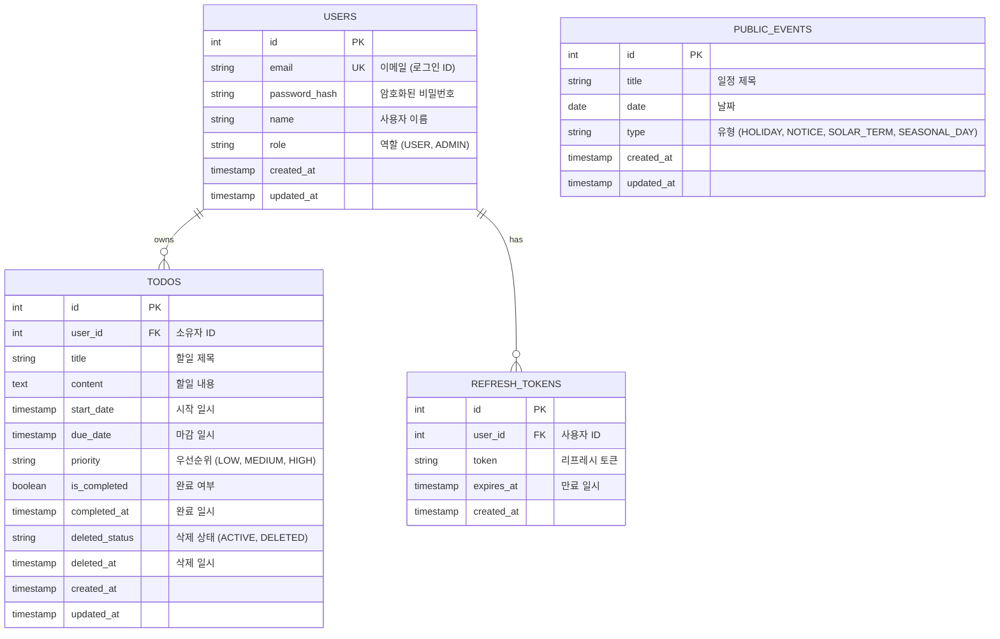

# JKN-TODOLIST 데이터베이스 설계 (ERD)

## 1. 설계 원칙
- **네이밍 규칙**: PostgreSQL 표준인 `snake_case`를 사용합니다. (테이블명, 컬럼명)
- **테이블명**: 복수형(Plural)을 사용합니다. (예: `users`, `todos`)
- **식별자**: 기본 키(PK)는 `id` (Serial/Integer)를 사용합니다. (MVP 개발 속도 및 편의성 고려)
- **일관성**: 모든 테이블에 `created_at`, `updated_at` 타임스탬프를 포함합니다.
- **보안**: 비밀번호는 해시값으로 저장하며, 토큰은 별도 테이블로 관리하여 보안성을 높입니다.

## 2. ERD 다이어그램 (Mermaid)

## 3. 테이블 상세 명세

### 3.1 Users (사용자)
사용자 계정 정보를 저장합니다.

| 컬럼명 | 데이터 타입 | 제약 조건 | 설명 |
|---|---|---|---|
| `id` | SERIAL | PK | 고유 식별자 |
| `email` | VARCHAR(255) | UNIQUE, NOT NULL | 로그인 이메일 |
| `password_hash` | VARCHAR(255) | NOT NULL | bcrypt 해시된 비밀번호 |
| `name` | VARCHAR(100) | NOT NULL | 사용자 실명 |
| `role` | VARCHAR(20) | NOT NULL, DEFAULT 'USER' | 권한 (USER, ADMIN) |
| `created_at` | TIMESTAMP | DEFAULT NOW() | 생성 일시 |
| `updated_at` | TIMESTAMP | DEFAULT NOW() | 수정 일시 |

### 3.2 Todos (할일)
사용자의 할일 정보를 저장합니다. 소프트 삭제(Soft Delete)를 지원합니다.

| 컬럼명 | 데이터 타입 | 제약 조건 | 설명 |
|---|---|---|---|
| `id` | SERIAL | PK | 고유 식별자 |
| `user_id` | INTEGER | FK (users.id), NOT NULL | 소유자 ID |
| `title` | VARCHAR(200) | NOT NULL | 할일 제목 |
| `content` | TEXT | NULL | 할일 상세 내용 |
| `start_date` | TIMESTAMP | NULL | 시작 예정 일시 |
| `due_date` | TIMESTAMP | NULL | 마감 예정 일시 |
| `priority` | VARCHAR(10) | DEFAULT 'MEDIUM' | 우선순위 (LOW, MEDIUM, HIGH) |
| `is_completed` | BOOLEAN | DEFAULT FALSE | 완료 여부 |
| `completed_at` | TIMESTAMP | NULL | 완료 처리 일시 |
| `deleted_status` | VARCHAR(10) | DEFAULT 'ACTIVE' | 삭제 상태 (ACTIVE, DELETED) |
| `deleted_at` | TIMESTAMP | NULL | 삭제 처리 일시 |
| `created_at` | TIMESTAMP | DEFAULT NOW() | 생성 일시 |
| `updated_at` | TIMESTAMP | DEFAULT NOW() | 수정 일시 |

### 3.3 Refresh Tokens (리프레시 토큰)
JWT 인증을 위한 리프레시 토큰을 관리합니다. 로그아웃 시 해당 토큰을 삭제하거나 무효화합니다.

| 컬럼명 | 데이터 타입 | 제약 조건 | 설명 |
|---|---|---|---|
| `id` | SERIAL | PK | 고유 식별자 |
| `user_id` | INTEGER | FK (users.id), NOT NULL | 사용자 ID |
| `token` | VARCHAR(512) | NOT NULL | 리프레시 토큰 문자열 |
| `expires_at` | TIMESTAMP | NOT NULL | 토큰 만료 일시 |
| `created_at` | TIMESTAMP | DEFAULT NOW() | 생성 일시 |

### 3.4 Public Events (공통 일정)
국경일 등 모든 사용자에게 보여지는 공통 일정을 저장합니다.

| 컬럼명 | 데이터 타입 | 제약 조건 | 설명 |
|---|---|---|---|
| `id` | SERIAL | PK | 고유 식별자 |
| `title` | VARCHAR(200) | NOT NULL | 일정 제목 |
| `date` | DATE | NOT NULL | 일정 날짜 |
| `type` | VARCHAR(20) | DEFAULT 'HOLIDAY', CHECK ('HOLIDAY', 'NOTICE', 'SOLAR_TERM', 'SEASONAL_DAY') | 일정 유형 |
| `created_at` | TIMESTAMP | DEFAULT NOW() | 생성 일시 |
| `updated_at` | TIMESTAMP | DEFAULT NOW() | 수정 일시 |
| `UNIQUE` | (date, title) | 제약 조건 | 날짜와 제목의 조합이 고유하도록 함 |

## 4. 인덱스 전략 (Indexing Strategy)
성능 최적화를 위해 다음 컬럼에 인덱스를 생성합니다.

- **users**: `email` (로그인 조회용)
- **todos**: `user_id` (내 할일 조회용), `deleted_status` (활성/삭제 필터링용)
- **refresh_tokens**: `token` (토큰 검증용), `user_id` (토큰 관리용)
