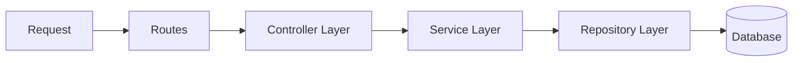
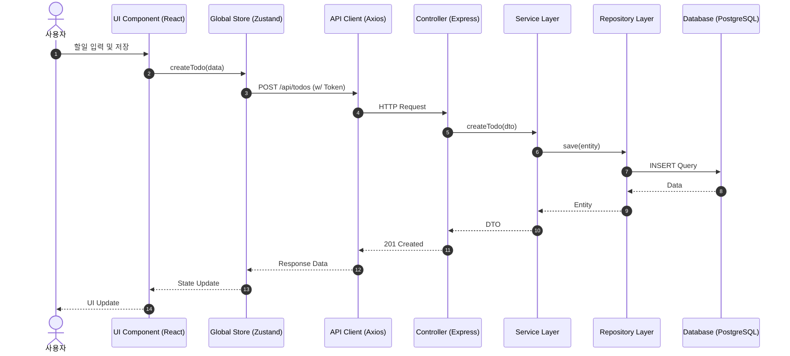

# JKN-TODOLIST 기술 아키텍처 (Technical Architecture)

본 문서는 JKN-TODOLIST 프로젝트의 상세 기술 아키텍처를 정의합니다.

## 1. 시스템 아키텍처 개요 (System Overview)

전체 시스템은 클라이언트-서버 구조를 따르며, RESTful API를 통해 통신합니다.

```mermaid
graph TD
    User[사용자] -->|HTTPS| Client[Frontend (React)]
    Client -->|REST API (JSON)| Server[Backend (Node.js/Express)]
    Server -->|SQL| DB[(Database (PostgreSQL))]

    subgraph "Frontend (Vercel)"
        Client
    end

    subgraph "Backend (Vercel)"
        Server
    end

    subgraph "Data Layer (Supabase)"
        DB
    end
```

## 2. 프론트엔드 아키텍처 (Frontend Architecture)

### 2.1 디렉토리 구조 (Directory Structure)

기능별 모듈화보다는 역할별 분리를 기본으로 하되, 도메인 로직의 응집도를 고려합니다.

```
src/
├── api/            # Axios 인스턴스 및 API 호출 함수
├── assets/         # 이미지, 폰트 등 정적 자원
├── components/     # 재사용 가능한 UI 컴포넌트
│   ├── common/     # 버튼, 입력창 등 공통 컴포넌트
│   ├── layout/     # 헤더, 사이드바 등 레이아웃 컴포넌트
│   └── todo/       # 할일 관련 도메인 컴포넌트
├── hooks/          # 커스텀 React Hooks
├── pages/          # 라우트 페이지 컴포넌트
├── store/          # Zustand 상태 관리 스토어
├── styles/         # 전역 스타일 및 Tailwind 설정
├── types/          # TypeScript 타입 정의 (사용 시)
└── utils/          # 유틸리티 함수
```

### 2.2 상태 관리 전략 (State Management)

**Zustand**를 사용하여 전역 상태를 관리합니다.

- **AuthStore**: 사용자 로그인 상태, 토큰, 사용자 정보 관리
- **TodoStore**: 할일 목록, 필터링 상태, CRUD 작업 상태 관리
- **UIStore**: 모달 열림/닫힘, 토스트 메시지, 사이드바 상태 등 UI 상태

### 2.3 라우팅 (Routing)

`react-router-dom`을 사용하며, 인증 여부에 따른 보호된 라우트(Protected Route)를 구현합니다.

- `/login`, `/signup`: 공개 라우트 (비로그인 시 접근 가능)
- `/`, `/trash`, `/settings`: 보호된 라우트 (로그인 필요)

## 3. 백엔드 아키텍처 (Backend Architecture)

### 3.1 계층형 아키텍처 (Layered Architecture)

관심사의 분리를 위해 3계층 구조(Controller-Service-Repository)를 채택합니다.



- **Controller**: HTTP 요청/응답 처리, 유효성 검사 (Validation)
- **Service**: 비즈니스 로직 수행, 트랜잭션 관리
- **Repository**: 데이터베이스 쿼리 실행, 데이터 매핑

### 3.2 디렉토리 구조

```
src/
├── config/         # 환경 변수 및 DB 설정
├── controllers/    # 요청 처리 컨트롤러
├── middlewares/    # 인증, 에러 핸들링 미들웨어
├── models/         # DB 모델 또는 쿼리 빌더 설정
├── routes/         # API 라우트 정의
├── services/       # 비즈니스 로직
├── utils/          # 유틸리티 및 헬퍼 함수
└── app.js          # 앱 진입점
```

### 3.3 에러 핸들링 (Error Handling)

- 전역 에러 핸들링 미들웨어를 통해 모든 예외를 중앙에서 처리합니다.
- 표준화된 에러 응답 포맷을 사용합니다.
  ```json
  {
    "success": false,
    "message": "에러 메시지",
    "code": "ERROR_CODE",
    "status": 400
  }
  ```

## 4. 데이터 흐름 및 보안 (Data Flow & Security)

### 4.1 인증 프로세스 (Authentication)

1. **로그인**: 클라이언트가 이메일/비번 전송 -> 서버 검증 -> Access Token(메모리/응답바디) & Refresh Token(HttpOnly Cookie 또는 DB저장 후 식별자 전달) 발급.
   - _본 프로젝트는 MVP 단계이므로 JWT를 응답 바디로 전달하여 클라이언트 로컬 스토리지에 저장하는 방식을 우선 고려하되, 보안 강화를 위해 추후 HttpOnly Cookie 방식으로 전환 가능._
2. **API 요청**: Authorization 헤더에 `Bearer <Token>` 포함하여 요청.
3. **토큰 검증**: 미들웨어에서 JWT 서명 및 만료 확인.

### 4.2 데이터베이스 접근

- **Connection Pool**: 성능을 위해 커넥션 풀을 사용합니다.
- **SQL Injection 방지**: Parameterized Query를 사용하여 SQL 인젝션을 원천 차단합니다.

### 4.3 데이터 처리 흐름 (Data Processing Flow)

사용자 요청이 처리되는 전체 흐름을 시각화합니다.



## 5. 배포 파이프라인 (Deployment)

- **Frontend**: GitHub Main 브랜치 푸시 -> Vercel 자동 빌드 및 배포
- **Backend**: GitHub Main 브랜치 푸시 -> Vercel 자동 빌드 및 배포 (Serverless Function)
- **Database**: Supabase 호스팅 (PostgreSQL)

## 6. 개발 환경 (Development Environment)

- **Linter/Formatter**: ESLint, Prettier
- **Package Manager**: npm
